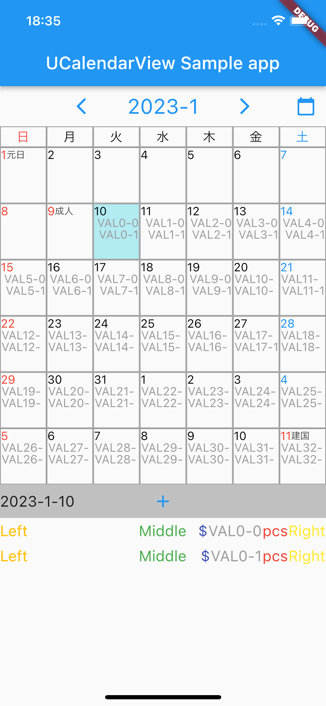

# u_calendar_view_dart

CalendarView for Dart

## Getting Started

### 1. pubspec.yaml
set plugin into pubspec.yaml.
```pubspec.yaml
u_calendar_view_dart:
```
### 2. Import
import as follows:
```
import 'package:u_calendar_view_dart/u_calendar_view_dart.dart';
```
### 3. Create Entries
```
List<UCEntry> ucEntries = List.empty(growable: true);

void initEntries() {
  for (int i = 0; i < 7 * 6; i++) {
    for (int j = 0; j < 2; j++) {
      UCEntry entry = UCEntry();
      entry.applicationTag = const Uuid().v1();
      entry.date = DateTime.now().add(Duration(days: i));
      entry.leftLabel = "Left";
      entry.leftLabelColor = Colors.amber;
      entry.middleLabel = "Middle";
      entry.middleLabelColor = Colors.green;
      entry.unitStart = "\$";
      entry.unitStartColor = Colors.indigo;
      entry.value = "VAL$i-$j";
      entry.valueColor = Colors.grey;
      entry.unitEnd = "pcs";
      entry.unitEndColor = Colors.red;
      entry.rightLabel = "Right";
      entry.rightLabelColor = Colors.yellow;
      entry.tableFontSize = 14.0;
      entry.listFontSize = 18.0;
      entry.tableAlignment = Alignment.centerRight;
      ucEntries.add(entry);
    }
  }
}
```

### 4.　Create callback functions
```
Future<UCEntry?> ucOnAddEntry(BuildContext context, DateTime? date) async {
    // Process
}

void ucOnTapEntry(BuildContext context, UCEntry ucEntry) {
    // Process
}

void ucOnMonthChanged(BuildContext context, int setYear, int setMonth) {
    // Process
}
```

### 5. Set entries and callback functions
Call UCalendarView()
```
bool debug = false;

@override
Widget build(BuildContext context) {
  return MaterialApp(
      localizationsDelegates: const [
        S.delegate,
        GlobalMaterialLocalizations.delegate,
        GlobalWidgetsLocalizations.delegate,
        GlobalCupertinoLocalizations.delegate
      ],
      supportedLocales: const [
        Locale("en"),
        Locale("ja")
      ],
      home: Scaffold(
          appBar: AppBar(
            title: const Text('UCalendarView Sample app'),
          ),
          body: UCalendarView(
              DateTime.now(), 3, ucEntries, ucOnAddEntry, ucOnTapEntry, ucOnMonthChanged, debug)));
}
```

## Sample App
 
